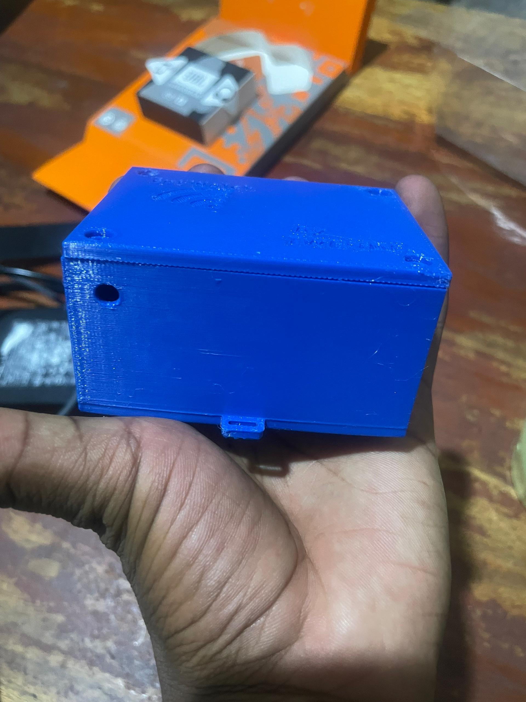
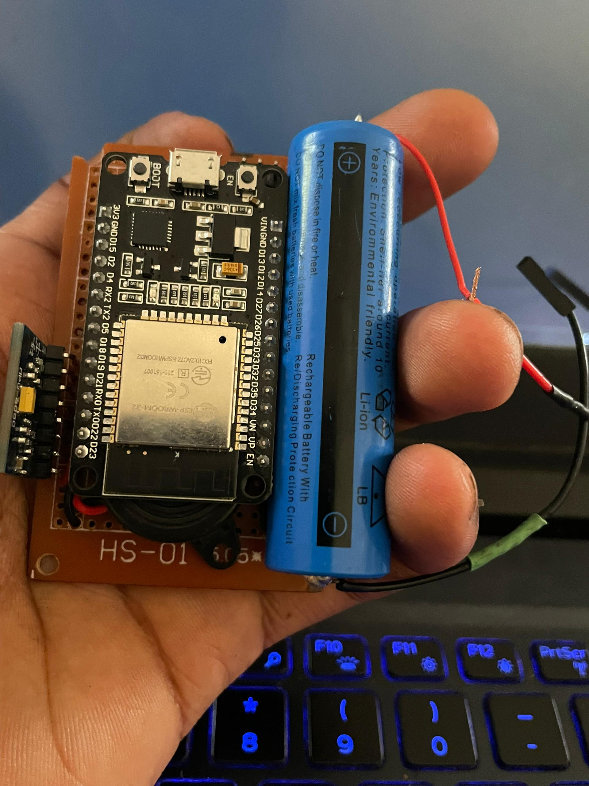
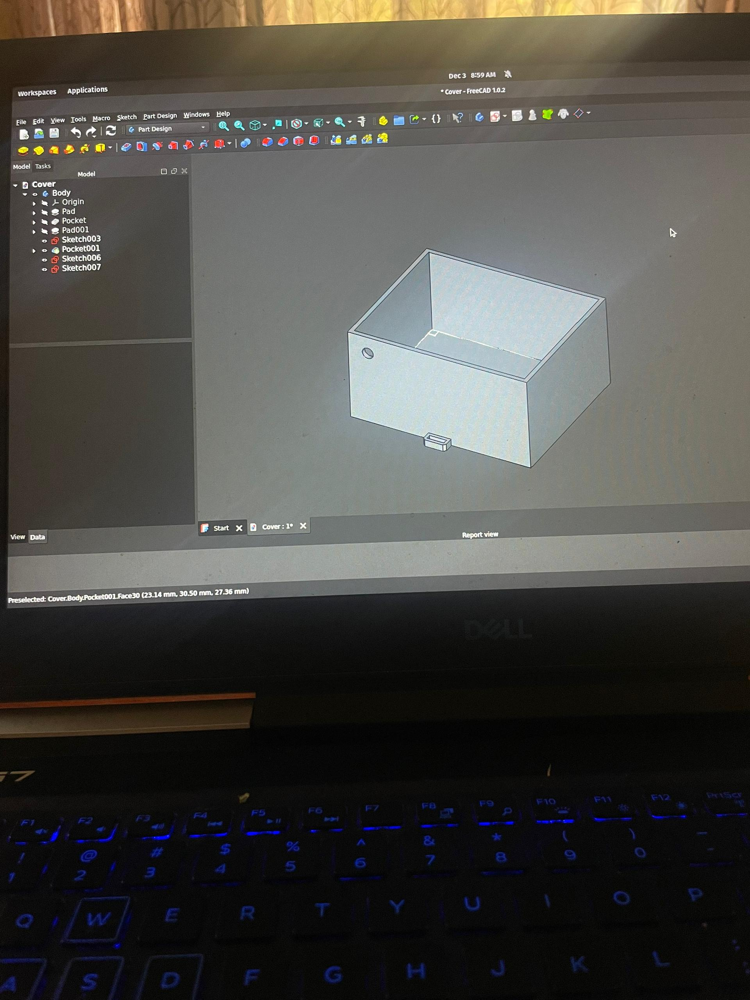

# EpiWatch - Epileptic Motion Detection System



A motion-based epilepsy detection prototype designed to support student safety and real-time monitoring in educational environments. The system uses an ESP32-DOIT microcontroller and MPU-6050 6-axis accelerometer/gyroscope to capture motion data. Using Edge Impulse, the device runs a lightweight machine learning model directly on the ESP32 for real-time classification of seizure-like movement patterns.

> **⚠️ Important**: This is a defensive safety tool designed to assist with monitoring and early alert systems. It's not intended as a medical diagnostic device but rather as an assistive technology for educational environments.

## 🎯 Project Overview

EpiWatch combines affordable hardware with advanced machine learning to create a wearable device that can detect abnormal motion patterns associated with seizure activity. The system provides immediate alerts through multiple channels while maintaining privacy through on-device processing.

### Key Features

- **Real-time Motion Analysis**: 6-axis sensor data processed at 43Hz
- **On-Device ML Inference**: Edge Impulse model runs locally on ESP32
- **Multi-Modal Alerts**: buzzer and configurable output pins
- **Low Power Design**: Optimized for wearable applications
- **Confidence Averaging**: Reduces false positives through temporal smoothing
- **Open Source**: Complete hardware design and software stack

## 🔧 Hardware Components



### Core Components
- **ESP32-DOIT DevKit V1**: Main microcontroller with WiFi/Bluetooth
- **MPU-6050**: 6-axis accelerometer/gyroscope sensor
- **Alert Components**: Buzzer (Pin 23)
- **Power**: 18650 lithium battery or USB power

### Wiring Diagram
```
ESP32          MPU-6050
-----          --------
3.3V     →     VCC
GND      →     GND
GPIO 21  →     SDA
GPIO 22  →     SCL

ESP32          Alerts
-----          ------
GPIO 23  →     Buzzer
```

## 🏗️ 3D Printed Enclosure



The project includes a custom 3D-printable enclosure designed in FreeCAD:
- **Files**: `CAD/Cover-Body.stl`, `CAD/Top_lid.FCStd`
- **Material**: PLA plastic recommended
- **Design**: Compact wearable form factor with sensor access
- **Assembly**: Snap-fit design for easy assembly

## 📊 Machine Learning Pipeline

### Data Collection
The system collects sensor data at 43Hz sampling rate:
- **Accelerometer**: X, Y, Z axes (±8G range)
- **Gyroscope**: X, Y, Z axes (±500°/s range)
- **Window Size**: 2 seconds (86 samples)
- **Classes**: Normal activity vs. seizure-like motion

### Model Training
- **Platform**: Edge Impulse
- **Processing**: Spectral analysis for frequency domain features
- **Architecture**: Neural network with 20-neuron hidden layer
- **Performance**: >85% accuracy with <50ms inference time

## 🚀 Getting Started

### Prerequisites
```bash
# Install PlatformIO
pip install platformio

# Install Python dependencies for data collection
pip install pandas numpy pyserial

# Install Edge Impulse CLI (optional)
npm install -g edge-impulse-cli
```

### Building and Flashing

1. **Clone the repository**
   ```bash
   git clone <repository-url>
   cd epiwatch_deployment
   ```

2. **Build the firmware**
   ```bash
   pio run
   ```

3. **Flash to ESP32**
   ```bash
   pio run --target upload
   ```

4. **Monitor output**
   ```bash
   pio device monitor
   ```

## 📈 Data Collection & Training

### Collecting Training Data

1. **Normal Activity Data**
   ```bash
   cd data-collector-tool
   python3 script_collector.py -p /dev/ttyUSB0 -l "normal" -o ../dataset/normal.csv -d 60
   ```

2. **Seizure Simulation Data**
   ```bash
   python3 script_collector.py -p /dev/ttyUSB0 -l "seizure" -o ../dataset/seizure.csv -d 60
   ```

### Preparing Data for Edge Impulse
```bash
cd data
python3 prepare_for_edge_impulse.py -i ../dataset -o edge_impulse_data
```

### Training the Model
Follow the comprehensive guide in `data/edge_impulse_training_guide.md` for detailed steps on:
- Creating an Edge Impulse project
- Uploading training data
- Configuring the impulse
- Training and optimizing the model
- Deploying to ESP32

## 🔍 System Operation

### Real-time Detection
The device continuously monitors motion and provides:
- **Confidence Scoring**: Probability values for each prediction
- **Temporal Averaging**: Smooths predictions over 5 samples
- **Threshold-based Alerts**: Configurable seizure detection threshold (default: 0.7)
- **Alert States**: Visual and auditory feedback

### Serial Output Example
```
Predictions (DSP: 3 ms, NN: 12 ms): normal: 0.95 seizure: 0.05
Average confidence over 5 samples: 0.04
✅ Normal activity detected.
```

## 📁 Project Structure

```
epiwatch_deployment/
├── src/                    # ESP32 source code
│   ├── main.cpp           # Main inference and alert logic
│   └── data_collection.cpp # Data collection mode
├── data-collector-tool/    # Python data collection scripts
├── data/                  # Edge Impulse training utilities
├── dataset/               # Raw training data (CSV)
├── CAD/                   # 3D printable enclosure files
├── sample/                # Hardware photos and documentation
└── lib/                   # Edge Impulse library
```

## ⚙️ Configuration

### Adjustable Parameters
- **Seizure Threshold**: Confidence level for triggering alerts
- **Sample Rate**: Data collection frequency (default: 43Hz)
- **Confidence Samples**: Number of samples for temporal averaging
- **Alert Pins**: GPIO assignments of buzzer

### Customization
The system can be extended with:
- WiFi/Bluetooth connectivity for remote alerts
- Data logging to SD card
- Integration with smartphone apps
- Multiple sensor fusion (heart rate, temperature)

## 🤝 Contributing

This is an open-source defensive safety project. Contributions are welcome for:
- Improved ML models and feature extraction
- Hardware optimizations and new sensor integration
- Enhanced alert mechanisms
- Documentation and educational resources

## 📄 License

This project is licensed under the terms specified in the LICENSE file.

## 🔗 References

- [Edge Impulse Documentation](https://docs.edgeimpulse.com/)
- [ESP32 Arduino Core](https://docs.espressif.com/projects/arduino-esp32/)
- [MPU-6050 Sensor Library](https://github.com/adafruit/Adafruit_MPU6050)
- [PlatformIO Documentation](https://docs.platformio.org/)

---

**Built for educational and assistive purposes - helping create safer learning environments through technology.**